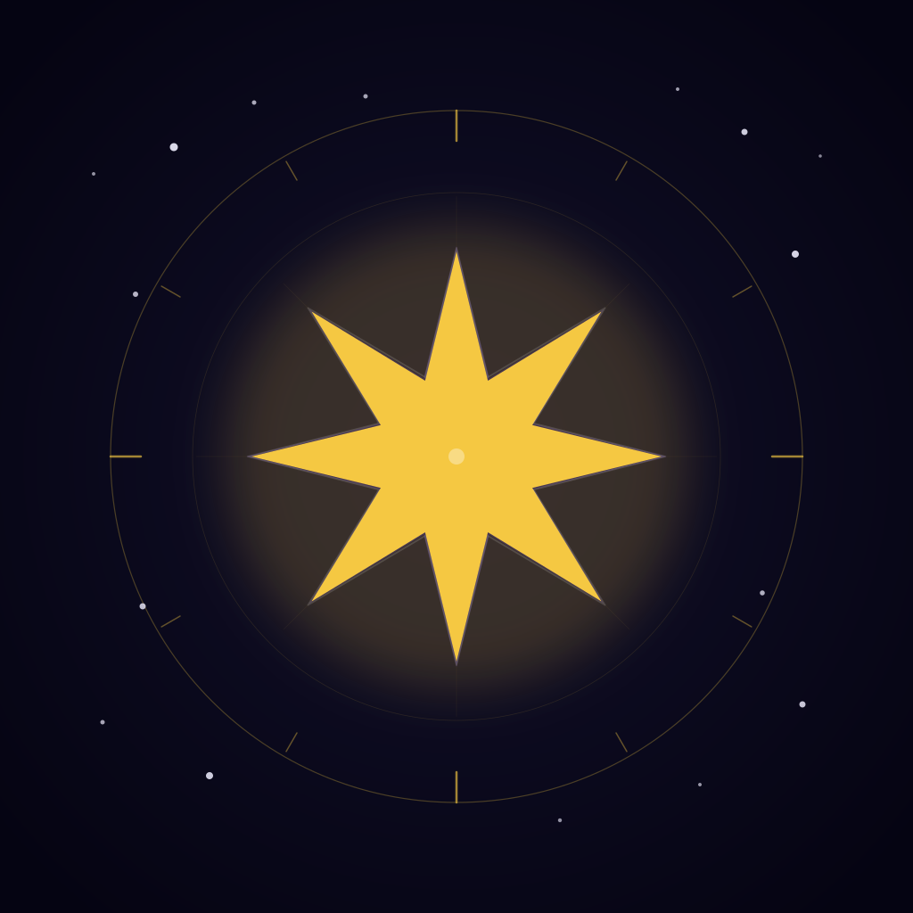
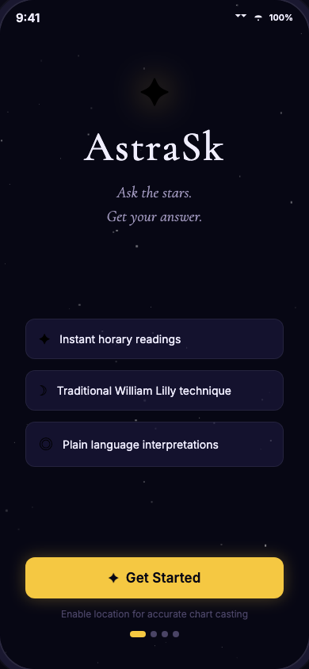
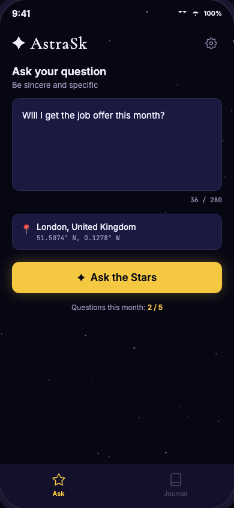
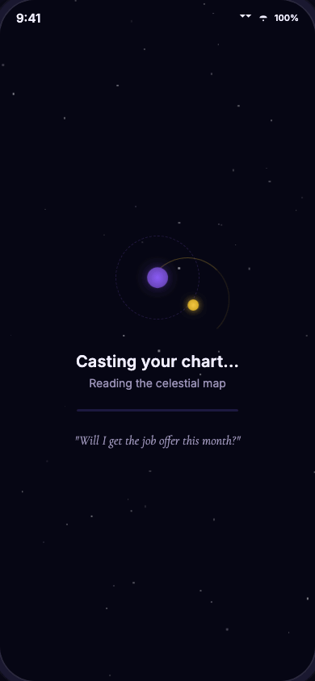
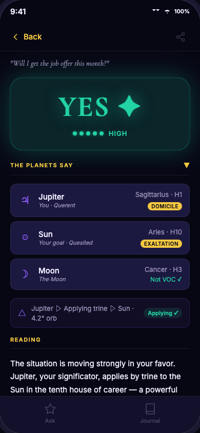
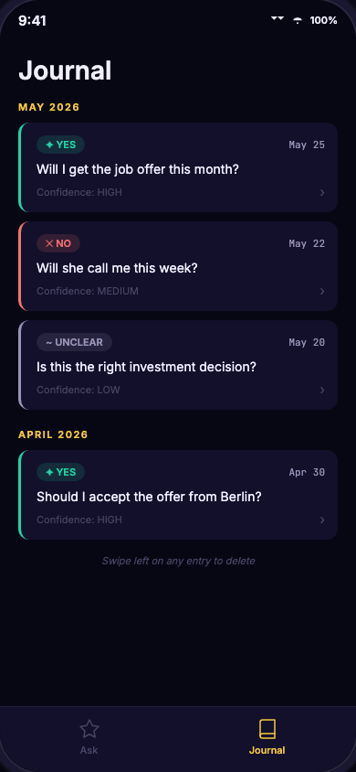
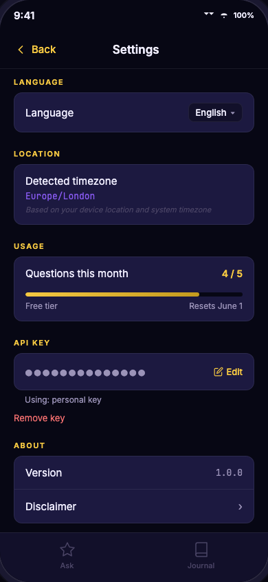

<div align="center">
  

  <h1>AstraSk</h1>

  <p><em>Ask a sincere question. The sky will answer.</em></p>

  <p>
    
    
    
  </p>
  <p>
    
    
    
  </p>
</div>

---

## What is AstraSk?

**AstraSk** is a mobile horary astrology app for iOS and Android. Horary astrology is a traditional astrological technique that answers a specific question by casting a chart for the exact moment and place the question was asked — and interpreting planetary positions, dignities, and aspects to give a verdict.

You ask a sincere, specific yes-or-no question. AstraSk captures your precise location and time, sends them to the [astrology-api.io](https://astrology-api.io) chart engine, and returns a verdict — **YES**, **NO**, **MAYBE**, or **UNCLEAR** — together with a plain-language summary and the key planetary significators behind the answer.

---

## How it Works

```
  1. Ask         2. Cast          3. Interpret     4. Save
  ────────       ─────────────    ─────────────    ────────
  Type your      Your GPS +       Planets, signs,  Reading
  question       timestamp sent   aspects → AI     saved to
  (5–280 chars)  to chart engine  interpretation   Journal
```

1. **Ask** — Enter a sincere, specific question on the Home screen (5–280 characters).
2. **Location** — Your coordinates and timezone are captured automatically via GPS.
3. **Cast** — AstraSk sends the request to `astrology-api.io`, which casts a horary chart for that exact moment and place.
4. **Verdict** — The API interprets planetary dignities, aspects, and significators and returns: verdict (`YES / NO / MAYBE / UNCLEAR`), confidence band (`high / medium / low`), a plain-language summary, and the key significators.
5. **Void-of-Course Moon** — If the Moon is void-of-course, a note is shown: "nothing may come of the matter."
6. **Save** — Every reading is saved automatically to your local Journal.

---

## Screenshots

| Onboarding | Home | Loading |
|:---:|:---:|:---:|
|  |  |  |
| *3-step first-run flow* | *AskForm + location + counter* | *Planet orbit animation* |

| Verdict (YES) | Journal | Settings |
|:---:|:---:|:---:|
|  |  |  |
| *Answer card + significators* | *Readings grouped by month* | *Language, API key, usage counter* |

---

## Features

### Core
- **Horary chart interpretation** — Full astrological chart cast for your exact GPS coordinates and local time
- **Verdicts** — YES / NO / MAYBE / UNCLEAR with high / medium / low confidence bands
- **Significators** — Querent and quesited planets shown with sign, house, dignity, retrograde status, and aspect
- **Void-of-Course Moon** — Detected and flagged with an interpretive note
- **Local Journal** — All readings saved on-device, grouped by month, unlimited history (up to 500 entries)

### UX & Design
- **Deep-space visual theme** — Dark navy palette with gold and violet accents
- **Animated cosmic background** — 60 twinkling stars + animated planet orbits via Reanimated 4
- **Animated splash screen** — 8-point starburst with fade-in on boot
- **Smooth transitions** — Spring and timing animations throughout
- **3-step onboarding** — Welcome → How it works → Location permission

### Reliability
- **Offline resilience** — API errors shown as dismissible banners; location-denied state handled gracefully
- **Retry policy** — 3 attempts, exponential back-off (1s / 2s / 4s) for 5xx and network errors
- **Force-update gate** — Remote config blocks outdated native builds before they reach broken API contracts
- **Monthly question counter** — 5 questions/month (MVP limit), auto-reset on the 1st of each month

### Localization & Accessibility
- **English + Russian** — Full i18n via `react-i18next`; language persisted in AsyncStorage
- **Timezone auto-detect** — IANA timezone captured at question submission via `Intl`
- **Accessibility labels** — All interactive elements have `accessibilityLabel` + `accessibilityRole`

---

## Tech Stack

| Layer | Technology |
|---|---|
| Framework | [Expo](https://expo.dev) SDK 55 / [React Native](https://reactnative.dev) 0.83 |
| Language | TypeScript 5.9 (strict) |
| Navigation | [Expo Router](https://expo.github.io/router) v4 (file-based) |
| Styling | [NativeWind](https://nativewind.dev) v5 + Tailwind CSS v4 |
| Animations | [Reanimated](https://docs.swmansion.com/react-native-reanimated/) 4 (UI-thread only) |
| SVG | [react-native-svg](https://github.com/software-mansion/react-native-svg) 15 |
| Data fetching | [TanStack React Query](https://tanstack.com/query/v5) v5 |
| State | [Zustand](https://zustand-demo.pmnd.rs) v5 |
| Storage | AsyncStorage (journal, settings) + SecureStore (API key) |
| i18n | [react-i18next](https://react.i18next.com) 17 |
| Fonts | Cormorant Garamond (display) + Inter (body) via `@expo-google-fonts` |
| Icons | [Lucide React Native](https://lucide.dev) |
| HTTP | Axios with request/response interceptors |
| API | [astrology-api.io](https://astrology-api.io) — horary chart engine |

---

## Getting Started

### Prerequisites

- [Node.js](https://nodejs.org) ≥ 20
- [Expo CLI](https://docs.expo.dev/more/expo-cli/): `npm install -g expo-cli`
- [Expo Go](https://expo.dev/client) on your iOS or Android device **or** a simulator
- An [astrology-api.io](https://astrology-api.io) API key (required for verdicts)

### Install

```bash
git clone https://github.com/your-org/horary-astrology-v1-app.git
cd horary-astrology-v1-app
npm install
```

### Configure environment

```bash
cp .env.local.example .env.local
```

Edit `.env.local`:

```env
# Required — get your key at https://astrology-api.io
EXPO_PUBLIC_ASTROLOGY_API_KEY=your_api_key_here

# Optional — leave empty until production build
EXPO_PUBLIC_UPDATE_CONFIG_URL=
```

### Run

```bash
npx expo start
```

Scan the QR code with Expo Go, or press `i` for iOS simulator / `a` for Android emulator.

### Verify

```bash
npm run typecheck   # TypeScript — must pass with 0 errors
npm run lint        # ESLint — must pass with 0 errors
npm test            # Jest — 7 tests must pass
npx expo-doctor     # Must show 19/19 checks passing
```

---

## Project Structure

```
horary-astrology-v1-app/
├── assets/
│   └── images/                  # App icons, splash image
├── docs/
│   ├── features/                # Per-feature technical guides
│   ├── ops/                     # Operational runbooks (env, deployment)
│   ├── orchestration/           # Process artifacts (handoff log, plans)
│   ├── screenshots/             # App screenshots
│   ├── html-prototype/          # Interactive HTML prototype
│   └── *.md                     # Product artifacts (PRD, architecture, etc.)
├── src/
│   ├── app/
│   │   ├── (tabs)/
│   │   │   ├── _layout.tsx      # Tab bar configuration
│   │   │   ├── index.tsx        # Home screen (Ask)
│   │   │   ├── journal.tsx      # Journal screen
│   │   │   ├── settings.tsx     # Settings screen
│   │   │   └── result/[id].tsx  # Verdict detail screen
│   │   ├── onboarding.tsx       # First-run 3-step flow
│   │   └── _layout.tsx          # Root layout (fonts, stores, boot gate)
│   ├── components/
│   │   ├── svg/                 # Animated SVG: StarField, PlanetOrbit, VerdictStar, ChartWheel
│   │   ├── ui/                  # Button, Card, Badge, Input, Banner, EmptyState, SkeletonItem
│   │   ├── AskForm.tsx          # Question input + location row + submit
│   │   ├── AnimatedSplash.tsx   # Boot splash with starburst animation
│   │   ├── CosmosBackground.tsx # Twinkling star field + planet orbits
│   │   ├── ForceUpdateScreen.tsx# Blocking update gate
│   │   ├── JournalItem.tsx      # Swipeable journal card
│   │   ├── SignificatorRow.tsx  # Planet significator row in verdict
│   │   └── VerdictCard.tsx      # YES/NO/MAYBE/UNCLEAR verdict card
│   ├── constants/
│   │   ├── config.ts            # URLs, limits, storage keys
│   │   ├── theme.ts             # Colors, typography, spacing
│   │   └── planets.ts           # Planet glyph map
│   ├── hooks/
│   │   ├── useHoraryQuery.ts    # React Query mutation (ask → save → navigate)
│   │   ├── useJournal.ts        # Journal CRUD
│   │   ├── useLocation.ts       # GPS + geocode
│   │   └── withMinDuration.ts   # Promise wrapper for min loading time
│   ├── i18n/
│   │   ├── en.ts                # English strings
│   │   └── ru.ts                # Russian strings
│   ├── services/
│   │   ├── horaryApi.ts         # Axios client for astrology-api.io
│   │   ├── journalService.ts    # AsyncStorage CRUD for journal
│   │   ├── locationService.ts   # expo-location wrapper
│   │   ├── secureKeyService.ts  # SecureStore wrapper for API key
│   │   └── updateCheckService.ts# Remote config + force-update logic
│   ├── stores/
│   │   ├── questionsStore.ts    # Journal entries + monthly counter (Zustand)
│   │   └── settingsStore.ts     # Locale + API key source (Zustand)
│   ├── tw/
│   │   └── index.tsx            # NativeWind-wrapped RN primitives
│   └── types/
│       ├── horary.ts            # API request/response interfaces
│       ├── journal.ts           # JournalEntry interface
│       └── navigation.ts        # Route param types
└── ...
```

---

## Configuration

All runtime configuration lives in environment variables. Never commit `.env.local`.

| Variable | Required | Description |
|---|---|---|
| `EXPO_PUBLIC_ASTROLOGY_API_KEY` | Yes (for verdicts) | Default API key for `astrology-api.io`. Users can override with their own key in Settings. |
| `EXPO_PUBLIC_UPDATE_CONFIG_URL` | No (pre-release: leave empty) | URL to a remote JSON config for force-update enforcement. See [Force Update guide](docs/features/force-update.md). |

See [docs/ops/environment.md](docs/ops/environment.md) for full setup, secrets rotation, and EAS configuration.

---

## Documentation

| Document | Description |
|---|---|
| [docs/INDEX.md](docs/INDEX.md) | **Start here** — full documentation index |
| [docs/prd-v1.md](docs/prd-v1.md) | Product requirements |
| [docs/technical-architecture.md](docs/technical-architecture.md) | System architecture and module overview |
| [docs/api-integration-spec.md](docs/api-integration-spec.md) | astrology-api.io endpoints and error handling |
| [docs/design-system-brief.md](docs/design-system-brief.md) | Color tokens, typography, component library |
| [docs/features/ask-flow.md](docs/features/ask-flow.md) | Ask → API → Verdict flow |
| [docs/features/journal.md](docs/features/journal.md) | Journal storage and UI |
| [docs/features/onboarding.md](docs/features/onboarding.md) | First-run onboarding |
| [docs/features/settings.md](docs/features/settings.md) | Settings screen and API key management |
| [docs/features/animations.md](docs/features/animations.md) | Cosmic animations system |
| [docs/features/force-update.md](docs/features/force-update.md) | Force-update gate |
| [docs/ops/environment.md](docs/ops/environment.md) | Environment variables and secrets |

---

## Design Palette

| Token | Hex | Usage |
|---|---|---|
| `bgBase` | `#070714` | Screen background |
| `accentGold` | `#F5C842` | Primary accent, CTAs |
| `accentViolet` | `#8B5CF6` | Secondary accent, planets |
| `yes` | `#22D3A4` | YES verdict |
| `no` | `#F87171` | NO verdict |
| `maybe` | `#FBBF24` | MAYBE verdict |
| `unclear` | `#9B93B8` | UNCLEAR verdict |

Fonts: **Cormorant Garamond** (display / headings) + **Inter** (body / UI).

---

## Horary Astrology — Quick Primer

Horary astrology is a traditional technique where a chart is cast for the moment a question is sincerely asked. Unlike natal astrology (based on birth), horary answers a specific question by interpreting:

- **Significators** — the planets that "rule" the querent (asker) and the quesited (subject of the question)
- **Dignities** — whether a planet is strong (domicile, exaltation) or weak (detriment, fall, peregrine)
- **Aspects** — angular relationships between significators indicating "will this happen?"
- **Void-of-Course Moon** — when the Moon makes no more aspects before leaving its sign, traditionally meaning "nothing will come of the matter"

AstraSk automates this interpretation and presents the result in plain language.

---

## Contributing

This is an internal MVP. Contributions are managed through the Claude-driven orchestration workflow described in [CLAUDE.md](CLAUDE.md).

---

## License

Private — all rights reserved. Not open source.
